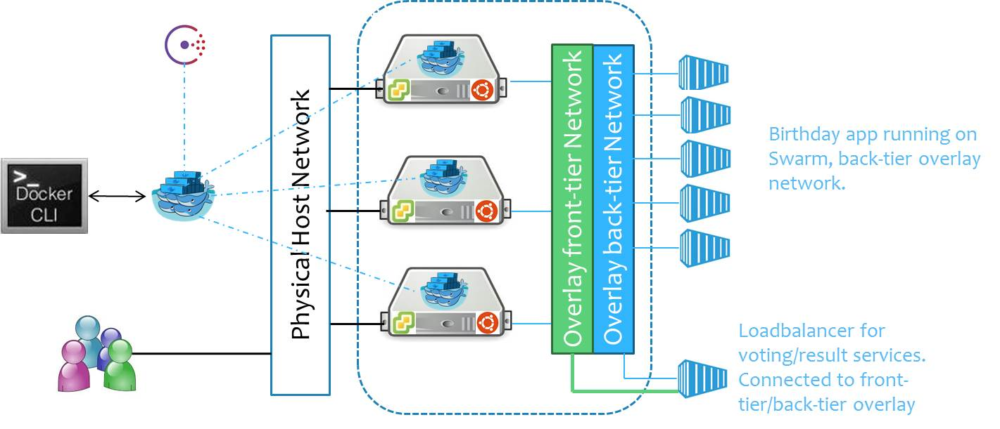

# Docker Birthday #3 Scalable/Secure Birthday app on Swarm:tada: :birthday: :tada:

> Scalable and Secured Birthday App Project on Docker Swarm

Participants in the training will go through the steps involved in setting up Docker swarm cluster, running and developing a simple voting app and scaling the application using docker-compose. This simple app will include:

- **A Python webapp**: which lets you vote between several options
- **A Redis queue**: which collects new votes
- **A Java worker**: which consumes votes and stores them in…
- …**A Postgres database**: backed by a Docker volume
- **A Node.js webapp**: which shows the results of the voting in real time
- **A Load balancer**: to access voting and result applications and to scale them
- **Docker Swarm Cluster**: All the services running on Docker swarm-cluster 

### Pre-tutorial preparation
Instructions available at https://github.com/dvnagesh/Docker-Bday-Meetup 
